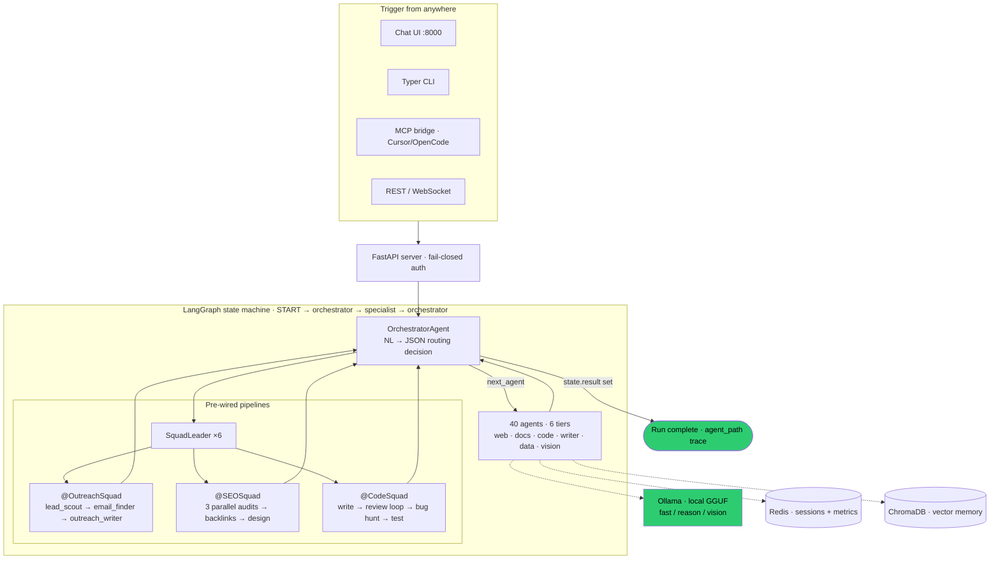

# 30 Agents — Local-First AI Pipelines You Own

**The business case in one line:** stop renting agency-grade outreach, SEO, and content pipelines by the token — run them on your own hardware at **$0 marginal inference cost**, with a routing trace you can put in front of a client.

---

## The Expensive Problem This Solves

If you bill for lead-gen, SEO, or content, you're currently paying cloud-API margin on every run and re-assembling the same pipeline by hand for every client. That is **revenue leakage** twice over: once to the model provider, once to unbillable setup time. This system turns the pipeline into an owned asset — lead discovery → email enrichment → personalized outreach → SEO audit → report — executed by 40 local specialist agents with a per-run audit trail and a cost report that reads $0.

---

## Architecture Graph

Mapped from the live knowledge graph (1,197 nodes · 2,486 edges). God nodes by connectivity: `AgentState` (124), `BaseAgent` (68), `Redis` (54+23), `SquadLeader` (26).



Every specialist returns a typed partial `AgentState`; setting `result` terminates the run. Full routing trace (`agent_path`) is injected automatically — you can show a client exactly which agents touched their job.

---

## R&D Status: Production Core, Actively Extending

**Production-ready and tested** (pytest, `asyncio_mode=auto`):

- Orchestrated routing over 40 agents with retry (tenacity, exp. backoff), per-agent Redis metrics, and consistent error routing
- **Fail-closed security** — HTTP middleware refuses all but `/api/health` with 503 when `API_SECRET` is unset; tool-call whitelist + blocked-arg patterns; PII scrubbing; Discord-webhook URL allowlist
- Full **outreach pipeline** (scrape → enrich → generate → send via Resend, dry-run by default) and **SEO pipeline** (on-page + technical + content in parallel, then backlinks)
- Sessions and long-term memory (Redis + embedded ChromaDB), KPI/cost reporting, Discord notifications, autopilot scheduler
- MCP stdio bridge (incl. auto-start hub) exposing 14 tools to Cursor / OpenCode / Claude Desktop

**Architecture Sandbox — roadmap nodes being hardened next:**

- Human-in-the-loop approval tools (12-factor factor 7) — designed, not wired
- Optional NVIDIA NIM acceleration path behind the existing client interface
- Additional squad configs via the JSON registry (no code changes required)

---

## Deployment ROI

Deploying this architecture gives a client an owned, auditable outreach + SEO + content pipeline that runs locally at zero marginal inference cost — the first campaign it runs is pipeline they would otherwise have paid cloud margin and setup hours to produce.

---

## Quick start

**Windows** — double-click `Start-Agents.bat` (first run creates the venv + installs deps), then open http://127.0.0.1:8000/. `Stop-Agents.bat` shuts it down.

**macOS / Linux** — `./start` (venv + Redis + Ollama + API), then open http://127.0.0.1:8000/.

```bash
python main.py health                        # Ollama + Redis + ChromaDB
python main.py chat "your task"              # one-shot orchestrated run
python main.py outreach --city Vancouver     # dry-run outreach pipeline
pytest                                       # test suite
```

**Docs:** [PRD](docs/PRD.md) · [ADR-001 — local-first inference](docs/ADR-001.md) · [AGENTS.md](AGENTS.md) (operator manual) · [Windows smoke checklist](docs/WINDOWS_SMOKE.md)

**Prerequisites for full LLM calls:** Ollama (local models) + Redis (auto-started by `./start`) + embedded ChromaDB. Without Ollama the API still runs; health reports `degraded`.

**Optional outreach keys** (`.env`): `SERPER_API_KEY`, `TAVILY_API_KEY`, `FIRECRAWL_API_KEY`, `HUNTER_API_KEY`, `RESEND_API_KEY`, `OUTREACH_EMAIL_FROM`, `OUTREACH_DOMAIN`.

**License:** see [LICENSE](LICENSE). Third-party notices: [THIRD_PARTY_NOTICES.md](THIRD_PARTY_NOTICES.md).
